# Kanpur AQI Predictor

I wanted to know if tomorrow's air quality in Kanpur could be predicted 
from today's pollution readings. Turns out: kind of, but not very well.

## What it does

Trains a Random Forest classifier on real CPCB data from Kanpur stations. 
Predicts tomorrow's AQI category (Good, Satisfactory, Moderate, Poor, Very Poor, 
Severe).

## Architecture

```mermaid
flowchart LR
    %% ---------- Styling ----------
    classDef source  fill:#eef4f0,stroke:#2f6f4e,stroke-width:1.5px,color:#18181b
    classDef process fill:#f5f5f5,stroke:#52525b,stroke-width:1px,color:#18181b
    classDef store   fill:#fdf6e3,stroke:#a16207,stroke-width:1.5px,color:#18181b
    classDef model   fill:#eff4fb,stroke:#1d4ed8,stroke-width:1.5px,color:#18181b
    classDef eval    fill:#f4effb,stroke:#7c3aed,stroke-width:1.5px,color:#18181b
    classDef artifact fill:#f0f0f5,stroke:#52525b,stroke-width:1px,color:#18181b

    %% ---------- Layer 1: Sources ----------
    subgraph L1["1 · Data Sources"]
        direction TB
        S1["Vonter CPCB Archive<br/><i>761 MB Parquet, 2025</i>"]
        S2["Synthetic Generator<br/><i>generate_sample_data.py</i>"]
    end

    %% ---------- Layer 2: Preparation ----------
    subgraph L2["2 · Data Preparation — prepare_real_data.py"]
        direction TB
        P1["Filter for Kanpur<br/>stations"]
        P2["Aggregate 15-min<br/>→ daily means"]
        P3["Compute AQI from PM2.5<br/>CPCB piecewise breakpoints"]
    end

    %% ---------- Layer 3: Features ----------
    subgraph L3["3 · Feature Engineering"]
        direction TB
        F1["Pollutants<br/>PM2.5 · PM10 · NO2 · SO2 · CO · O3"]
        F2["Weather<br/>Temperature · Humidity · Wind"]
        F3["Season Encoding<br/>sin/cos of day-of-year"]
        F4["Today's AQI"]
    end

    %% ---------- Layer 4: Model ----------
    subgraph L4["4 · Training — classifier.py"]
        direction TB
        M1["Chronological Split<br/>80% train · 20% test"]
        M2["SimpleImputer<br/>median strategy"]
        M3["RandomForestClassifier<br/>300 estimators · class-balanced"]
        M4["Persistence Baseline<br/>tomorrow = today"]
    end

    %% ---------- Layer 5: Evaluation ----------
    subgraph L5["5 · Evaluation"]
        direction TB
        E1["Accuracy vs. baseline"]
        E2["Classification report"]
        E3["Feature importance plot"]
        E4["Confusion matrix plot"]
    end

    %% ---------- Layer 6: Artifacts ----------
    subgraph L6["6 · Outputs"]
        direction TB
        O1["output/feature_importance.png"]
        O2["output/confusion_matrix.png"]
        O3["Next-day AQI prediction"]
    end

    %% ---------- Storage ----------
    DB[("kanpur_real.csv<br/>365 daily rows")]:::store

    %% ---------- Edges ----------
    S1 --> P1
    S2 -.-> DB
    P1 --> P2 --> P3 --> DB
    DB --> F1
    DB --> F2
    DB --> F3
    DB --> F4
    F1 --> M1
    F2 --> M1
    F3 --> M1
    F4 --> M1
    M1 --> M2 --> M3
    M1 --> M4
    M3 --> E1
    M3 --> E2
    M3 --> E3
    M3 --> E4
    M4 --> E1
    E3 --> O1
    E4 --> O2
    M3 --> O3

    %% ---------- Apply classes ----------
    class S1,S2 source
    class P1,P2,P3 process
    class F1,F2,F3,F4 process
    class M1,M2,M3 model
    class M4 eval
    class E1,E2,E3,E4 eval
    class O1,O2,O3 artifact
```

## Results

- Model accuracy: 67.1%
- Naive baseline ("tomorrow = today"): 61.6%

So it beats the dumb guess by about 5 points. Not amazing. I'll explain why below.

## Known limitation: AQI formula

This project computes AQI from PM2.5 using the official CPCB piecewise
breakpoint formula (see `prepare_real_data.py`). Real CPCB AQI takes the
**maximum sub-index across six pollutants** — PM2.5, PM10, NO2, SO2, CO,
and O3 — not PM2.5 alone.

On most high-pollution days in Kanpur, PM2.5 drives the maximum sub-index,
so this simplification is close. But days when PM10 or NO2 spike without
a corresponding PM2.5 spike will be miscategorised.

**What I'd do next:** implement the full six-pollutant sub-index
calculation and take the maximum.

## Why the accuracy is low

Two reasons I figured out while building this:

1. **The AQI formula I used at first was wrong.** I was doing `PM2.5 × 1.5`, which 
   underestimates high-pollution days. The real CPCB formula uses non-linear breakpoints. 
   After I fixed this, the labels changed a lot.

2. **The model only sees today's weather.** Tomorrow's wind speed and direction 
   matter a lot for AQI, but I don't have those as inputs. Adding them would probably help.

## What I'd do differently

- Add weather forecast features
- Try an LSTM or ARIMA instead of a classifier
- Predict the AQI number, not the category

## How to run it

1. Install dependencies: `pip install -r requirements.txt`
2. Download the Vonter Parquet file (see DATA.md)
3. Run `python prepare_real_data.py` to create `kanpur_real.csv`
4. Run `python classifier.py kanpur_real.csv`

Or just run the synthetic demo:
`python generate_sample_data.py`
`python classifier.py sample_kanpur_synthetic.csv`
